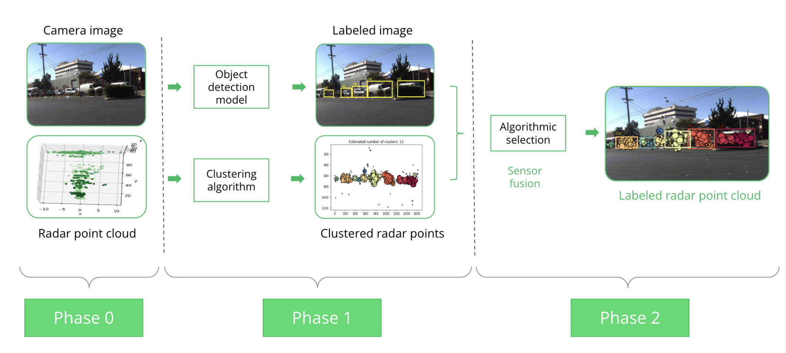
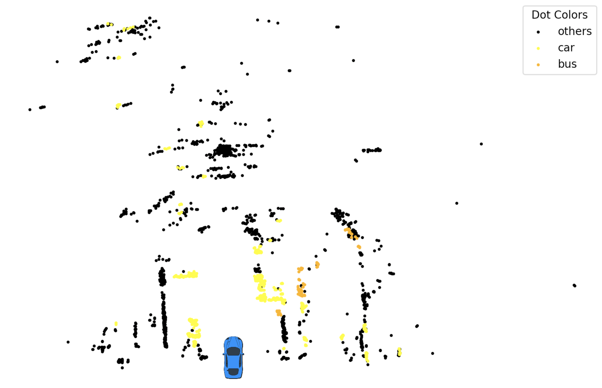
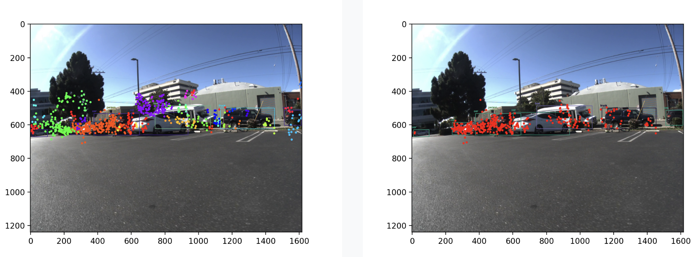

# ZendarComputerVisionCapstone

## Overview

This project focuses on detecting 3D space objects using radar point cloud and images. The detection pipeline combines YOLO for classification in the image space and DBSCAN for clustering and detecting objects in the radar space. The project aims to merge the detected objects from both modalities to provide a comprehensive view of the environment.



## Video Demonstration

<!-- Video Section -->
<p align="center">
  <a href="https://www.youtube.com/watch?v=Xsco6qeIno4">
    
  </a>
</p>

## Samples

<!-- Second and Third Images Side by Side -->
<p align="center">
  
  
</p>


## Project Structure

```plaintext
├── assets
│   ├── image1.png
│   ├── image2.png
│   ├── image3.png
├── DBscan
│   ├── run_dbscan.py
├── Yolo and undistortion
│   ├── yolo_opencv.py
│   ├── yolov3.cfg
│   ├── yolov3.txt
├── data
│   ├── 00000.npz
│   ├── extrinsics_intrinsics.npz
├── src
│   ├── camera_to_image.py
│   ├── radar_to_camera.py
│   ├── radar_to_image.py
│   ├── threeD_2D_table.py
│   ├── utils.py
│   ├── data
│   │   ├── dataset.py
│   │   ├── load.py
│   ├── model
│   │   ├── merge.py
│   │   ├── yolo.py
├── yolo_setup
│   ├── yolov3.cfg
│   ├── yolov3.txt
│   ├── yolov3.weights
├── .gitignore
├── DataViz-v2.ipynb
├── README.md
├── requirements.txt
├── run.py
```

## Getting Started

### Prerequisites

- Python 3.9 or higher
- Virtual environment tools (e.g., `venv`)

### Installation

1. **Clone the repository**:

```sh
  git clone https://github.com/yourusername/ZendarComputerVisionCapstone.git
  cd ZendarComputerVisionCapstone
```

2. **Set up the virtual environment**:

```sh
   python3 -m venv venv
   source venv/bin/activate  # On Windows use \`venv\Scripts\activate\`
```

3. **Install the dependencies**:

```sh
   pip install -r requirements.txt
```

### Directory Details

#### `DBscan`

- `run_dbscan.py`: Script that implements the DBSCAN clustering algorithm for identifying clusters in the radar data.

#### `Yolo and undistortion`

- `yolo_opencv.py`: Script for running YOLO object detection with OpenCV integration.
- `yolov3.cfg`: Configuration file for YOLOv3.
- `yolov3.txt`: Text file containing class labels for YOLOv3.

#### `data`

- `00000.npz`: Sample data for visualization.
- `extrinsics_intrinsics.npz`: File containing extrinsic and intrinsic parameters for the sensors.

#### `src`

- `camera_to_image.py`: Script to convert camera data to image format.
- `radar_to_camera.py`: Script to map radar data to camera coordinates.
- `radar_to_image.py`: Script to convert radar data to image format.
- `threeD_2D_table.py`: Script for 3D to 2D lookup table functions.
- `utils.py`: Utility functions for various tasks.

##### `src/data`

- `dataset.py`: Script for handling datasets and data projection.
- `load.py`: Script for loading and preprocessing data.

##### `src/model`

- `merge.py`: Script for merging detected objects.
- `yolo.py`: Script for running YOLO object detection.

#### `yolo_setup`

- `yolov3.cfg`: Configuration file for setting up YOLOv3.
- `yolov3.txt`: Text file containing class labels for YOLOv3.
- `yolov3.weights`: download from [here](https://pjreddie.com/media/files/yolov3.weights)

### Running the Script

1. **Download the YOLOv3 weights**

Download the weights from [here](https://pjreddie.com/media/files/yolov3.weights) and place them in the `yolo_setup` directory.

2. **Run the main script**:

```sh
   python run.py
```

### Detailed usage

1. **Data Preprocessing**:

   Use the scripts in the `src/data` directory to preprocess your radar images.

2. **Object Detection with YOLO**:

   Set up YOLO using the files in the `yolo_setup` directory and run the detection scripts from `Yolo and undistortion`.

3. **Clustering with DBSCAN**:

   Run the `run_dbscan.py` script located in the `DBscan` directory to perform clustering on the detected objects.

4. **Visualization**:

   Use the `DataViz.ipynb` notebook to visualize the results and gain insights into the detection and clustering performance.

### Contact

For any inquiries or questions, please open an issue or contact [hendrikchiche@gmail.com].
